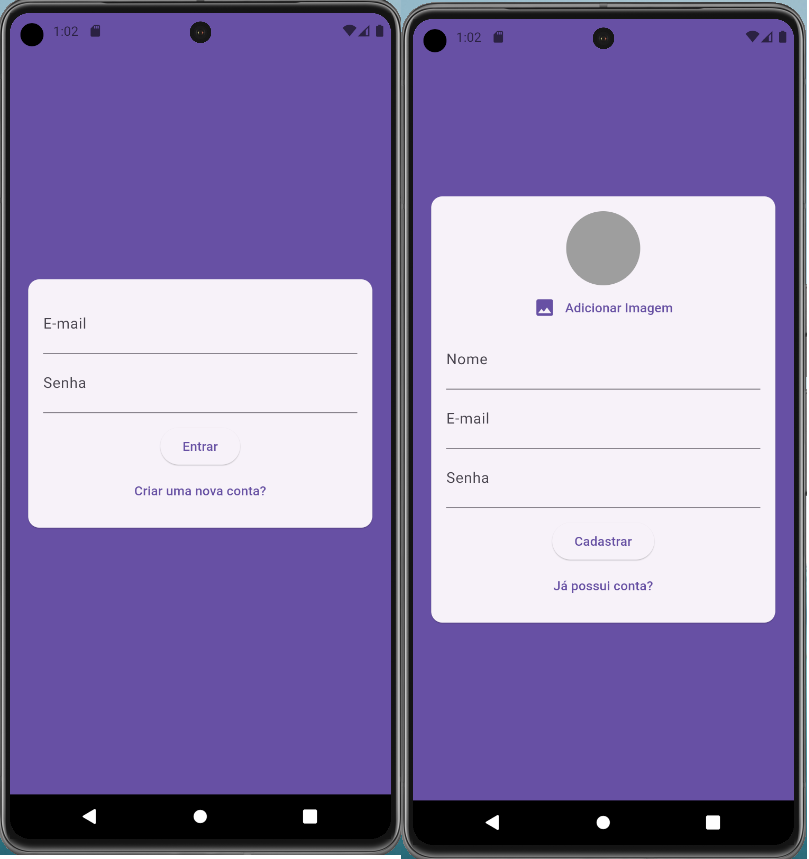

# chat_cod3r

 Esse é um projeto da `COD3R`,  `cod3r.com.br`,   pertencente ao curso `Aprenda Flutter & Dart e Construa APPs iOS e Android` chamado de `Aplicação de Chat - Firebase, Upload Imagem e Push Notifications.` que foi adaptado conforme o andamento do meu estudo
 
 - Telas de autenticação

 

 - Telas de notificação

 


 obs: este projeto não foi configurado para IOS 
 

Serviços abordados do firebase
   - Authentication
   - Storage
   - Realtine database
   - Messaging 

## Configuraçôes

1. Clone o repositório:
    ```bash
    git clone https://github.com/msbzz/chat_cod3r.git
    cd chat_cod3r
    ```

2. Instale as dependências:
    ```bash
    flutter pub get
    ```


3. Habilitar os serviços do firebase

- crie uma conta no firebase console
- instale o firebase cli
- use o comando - crie uma conta no firebase console
- instale o firebase cli

- delete o arquivo `firebase_options.dart` devido a ele ser gerado de forma automática pelo procedimento abaixo


- Estando dentro da pasta abra um prompt de comando
   - use o comando `firebase login` 
   - use o comando `firebase projects:list` para escolher o projeto id do firebase
   - use o comando `flutterfire configure --project=<project id>` 
 
- configurar permissionamentos no arquivo manifest (pronto)

4. Configure as variáveis de ambiente no arquivo `assets/.env` com as informações do seu projeto Firebase.

 Criar o arquivo `.env` dentro da pasta `assets` 

 ```plaintext
chat_cod3r/
│
├── assets/
│      └── .env
```

O arquivo `.env` é usado para armazenar informações sensíveis do projeto, como chaves de API e IDs do Firebase. Crie o arquivo c.env dentro da pasta `assets/` e adicione suas credenciais contidas em `firebase_options.dart` da seguinte forma:
 
```plaintext
FIREBASE_API_KEY=your_firebase_api_key
FIREBASE_AUTH_DOMAIN=your_firebase_auth_domain
FIREBASE_PROJECT_ID=your_firebase_project_id
FIREBASE_STORAGE_BUCKET=your_firebase_storage_bucket
FIREBASE_MESSAGING_SENDER_ID=your_firebase_messaging_sender_id
FIREBASE_APP_ID=your_firebase_app_id
FIREBASE_MEASUREMENT_ID=your_firebase_measurement_id
```

Configure definições das credenciais dentro arquivo `firebase_options.dart` para que fique conforme o conteudo abaixo

 
```plaintext

   static FirebaseOptions get web => FirebaseOptions(
    apiKey: dotenv.env['WEB_API_KEY']!,
    appId: dotenv.env['WEB_APP_ID']!,
    messagingSenderId: dotenv.env['WEB_MESSAGING_SENDER_ID']!,
    projectId: dotenv.env['PROJECT_ID']!,
    authDomain: dotenv.env['WEB_AUTH_DOMAIN']!,
    storageBucket: dotenv.env['WEB_STORAGE_BUCKET']!,
  );

  static FirebaseOptions get android => FirebaseOptions(
    apiKey: dotenv.env['ANDROID_API_KEY']!,
    appId: dotenv.env['ANDROID_APP_ID']!,
    messagingSenderId: dotenv.env['ANDROID_MESSAGING_SENDER_ID']!,
    projectId: dotenv.env['PROJECT_ID']!,
    storageBucket: dotenv.env['ANDROID_STORAGE_BUCKET']!,
  );

  static FirebaseOptions get ios => FirebaseOptions(
    apiKey: dotenv.env['IOS_API_KEY']!,
    appId: dotenv.env['IOS_APP_ID']!,
    messagingSenderId: dotenv.env['IOS_MESSAGING_SENDER_ID']!,
    projectId: dotenv.env['PROJECT_ID']!,
    storageBucket: dotenv.env['IOS_STORAGE_BUCKET']!,
    iosBundleId: dotenv.env['IOS_BUNDLE_ID']!,
  );

  static FirebaseOptions get macos => FirebaseOptions(
    apiKey: dotenv.env['IOS_API_KEY']!,
    appId: dotenv.env['IOS_APP_ID']!,
    messagingSenderId: dotenv.env['IOS_MESSAGING_SENDER_ID']!,
    projectId: dotenv.env['PROJECT_ID']!,
    storageBucket: dotenv.env['IOS_STORAGE_BUCKET']!,
    iosBundleId: dotenv.env['IOS_BUNDLE_ID']!,
  );

  static FirebaseOptions get windows => FirebaseOptions(
    apiKey: dotenv.env['WEB_API_KEY']!,
    appId: dotenv.env['WEB_APP_ID']!,
    messagingSenderId: dotenv.env['WEB_MESSAGING_SENDER_ID']!,
    projectId: dotenv.env['PROJECT_ID']!,
    authDomain: dotenv.env['WEB_AUTH_DOMAIN']!,
    storageBucket: dotenv.env['WEB_STORAGE_BUCKET']!,
  );

```

 